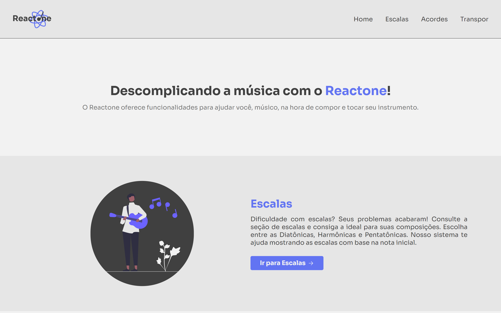

# Reactone

## :musical_score: **Projeto**

<h1 align="center">
    
</h1>

> Cansado de nunca saber uma escala completa porque não estudou teoria musical? Seus problemas acabaram! O Reactone faz ela e muito mais para você.

O Reactone é uma aplicação que trás um conjunto de ferramentas para auxiliar músicos com escalas, acordes e transposição de tom.

<p align="center">
   <a href="https://reactone-steel.vercel.app">Veja o projeto completo aqui.</a>
</p>

## :art: **Visual do Projeto**

### _Desktop e Telas Maiores_

<h1 align="center">
    
</h1>

### _Mobile e Telas Menores_

<h1 align="center">
    
</h1>

## :wrench: **Tecnologias**

### :hammer: **Construção do site**

- [TypeScript](https://www.typescriptlang.org)
- [React](https://pt-br.reactjs.org)
- [Node e NPM](https://nodejs.org/)
- [Vite](https://vitejs.dev/)

### :art: **Estilização**

- [Styled Components](https://styled-components.com)
- [Heroicons](https://heroicons.com)
- [Radix UI](https://www.radix-ui.com)
- [Google Fonts](https://fonts.google.com)

### :open_file_folder: **IDE, Versionamento e Deploy**

- [Visual Studio Code](https://code.visualstudio.com)
- [Git](https://git-scm.com)
- [GitHub](https://github.com)
- [Vercel](https://vercel.com/)

## :rocket: **Configurações e Instalação**

Veja [documentação de configuração do Vite](https://vitejs.dev/config/).

### **Clonando o Projeto**

```sh
git clone https://github.com/davsilvam/reactone.git
```

### **Executando o Projeto**

```sh
npm install
```

### **Compilar e abrir o programa para desenvolvimento**

```sh
npm run dev
```

### **Compilar e reduzir para produção**

```sh
npm run build
```

## :balance_scale: **Licença**

Esse projeto está sob a [licença MIT](https://github.com/davsilvam/reactone/blob/main/LICENSE.md).

<p align="center">
  Feito com :purple_heart: por <a href="https://www.linkedin.com/in/davsilvam/">David Silva</a>.
</p>

---
